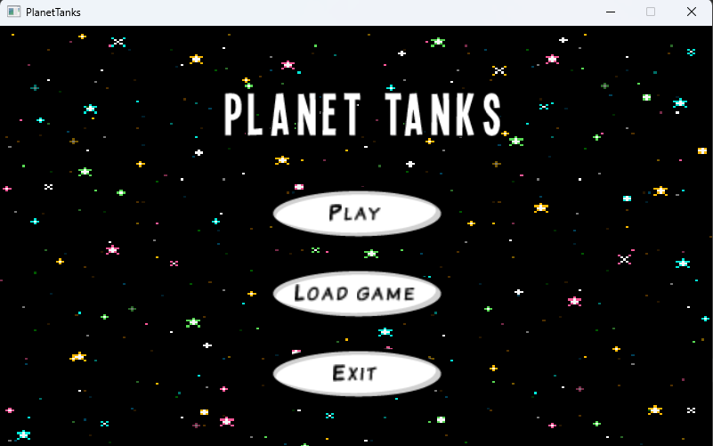

# Planet Tanks

A game developed using LibGDX framework (box 2d and scene2d) in Java inspired from [Tank Stars](https://apps.apple.com/us/app/tank-stars/id1347123739) on Apple Store.

The project focuses specially on the implementation of OOPS concepts.

## Includes

- UML use case diagram
- UML class diagram
- JUnit Tests
- OOPS concepts like inheritance, polymorphism and interfaces.

## Authors

- [@Lakshya Goel](https://www.github.com/lakshya-goel)
- [@Rajorshi Mondal](https://github.com/rajorshi1)

## Screenshots

